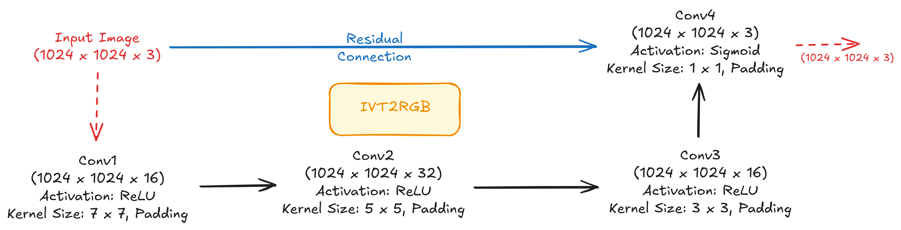

# DeepAR
<p align="center">
  
</p>

---

> **⚠️ Note**: This is an ongoing project under active development. Features, documentation and code may change.

---
DeepAR is a deep learning model designed for Atmospheric Rivers (AR) detection and segmentation from climate data (using the Climate variable IVT, IVT_u, IVT_v). It utilizes a modified, prompt-less Segment Anything Model (SAM) to generate segmentation masks, which are then refined into AR maps.

## Model Architecture
The DeepAR model processes data through a three-stage pipeline:
1. **Input Generator (`IVT2RGB`)**: A CNN that converts 3 channel climate data (Integrated Vapor Transport: `ivt`, `ivtu`, `ivtv`) into a 3 channel RGB-like image suitable for the image encoder.
2. **Segmentation (`SamAR`)**: A modified SAM model that operates without prompts. It uses a learned `no_mask_embedding` to generate segmentation masks from the features produced by the image encoder.

The diagram below illustrates the architecture:
<p align="center">
  
</p>
Below is the architecture of the `IVT2RGB` module:
<p align="center">
  
</p>

## Data
The model is designed to work with NetCDF files (.nc) containing `ivt`, `ivtu` and `ivtv` variables. Use the dataset class `ARInferenceDataset` for loading and preprocessing the data during inference.

## Installation
1. Clone the repository:
    ```bash
    git clone https://github.com/mphysicus/deep_AR.git
    cd deep_AR
    ```
2. Install the package:
    ```bash
    pip install -e .
    ```

## Pretrained Models
✨Coming Soon✨We will be uploading pre-trained model weights soon.


## 🙏 Acknowledgment
We are thankful to [Segment Anything](https://github.com/facebookresearch/segment-anything) for releasing their code as open-source contributions. We are also thankful to [AdaLoRA](https://github.com/QingruZhang/AdaLoRA) for their open-source contribution in AdaLoRA PEFT training.